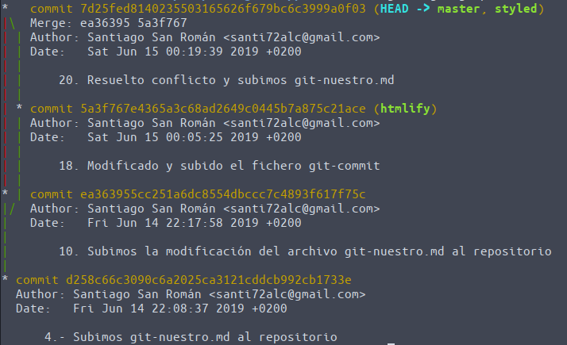

# Práctica del curso de git, gitHub y SourceTree
---
# 
EJERCICIO 1

Se deberá crear un repositorio y realizar una serie de operaciones desde la consola de comandos sobre el mismo para posteriormente subir el repositorio a Github.

Se deberá entregar a través del formulario de prácticas indicando la URL del repositorio. En el repositorio, deberá existir un archivo readme.md con las respuestas a las siguientes preguntas:

- ¿Qué comando utilizaste en el paso 11? ¿Por qué?  
git reset **--hard** HEAD~1  
_Por que es el que permite un reset "físico"_
- ¿Qué comando o comandos utilizaste en el paso 12? ¿Por qué?  
git reflog  
git reset **--hard** _ea36395_  
_Es el comando que nos permite volver al punto indicado con cambios físicos_
- El merge del paso 13, ¿Causó algún conflicto? ¿Por qué?  
_No. Sin conflictos._
- El merge del paso 19, ¿Causó algún conflicto? ¿Por qué?  
_Sí hubo conflico porque encontró el mismo fichero modificado en ambas ramas y pide que se solucione el conflicto. Se modifica el fichero indicado, se actualiza, sube a staging area y se hace el commit._
- El merge del paso 21, ¿Causó algún conflicto? ¿Por qué?  
_NO, Sin conflictos._
- ¿Qué comando o comandos utilizaste en el paso 25?  
git log --graph
- El merge del paso 26, ¿Podría ser fast forward? ¿Por qué?  
_No podría ser **fast forward** porque exite el mismo fichero con la línea modificada del título. Daría conflicto._
- ¿Qué comando o comandos utilizaste en el paso 27?  
git reset AHEAD~1
- ¿Qué comando o comandos utilizaste en el paso 28?  
git checkout -- git-nuestro.md
- ¿Qué comando o comandos utilizaste en el paso 29?  
git branch -D title
- ¿Qué comando o comandos utilizaste en el paso 30?  
git reflog  
git reset _7d25fed_
- ¿Qué comando o comandos usaste en el paso 32?  
git reflog  
git checkout _31739b7_
- ¿Qué comando o comandos usaste en el punto 33?  
git reflog  
git checkout _64632be_

#### Todos los pasos están indicados en detalle a continuación...
---

### 1. Crear un repositorio

Se crea el directorio
>mkdir practicaGit

Inicializo el repositorio
>git init

### 2. Crear un fichero _git-nuestro.md_

Creamos el fichero con el contenido indicado en la práctica
>gedit git-nuestro.md

### 3. Añadir _git-nuestro.md_ al staging area**

Se pasa el fichero git-nuestro.md al staging area
>git add git-nuestro.md

### 4. Pasar lo que hay en el staging area al repositorio

Hacemos la subida al repositorio
>git commit -m "4. Subimos git-nuestro.md al repositorio"

### 5. Crear una rama llamada "styled"

Creamos la rama
>git branch styled  
>>__Salida__:  
En la rama master
Archivos sin seguimiento:  
(usa "git add 'archivo'..." para incluirlo a lo que se será confirmado)

### 6. Listar las ramas que hay en el repositorio

Listamos las ramas existentes
>git branch  
>>__Salida__:  
\* master  
styled

### 7. Moverse a la rama "styled"

Nos movemos a la rama styled
>git checkout styled

### 8. Comprobar que se está en la rama correcta

Comprobamos ramas (_la que tiene el asterisco es la actual_ - **confirmado!!**)
>git branch

### 9. Modificar el archivo _git-nuestro.md_  (_según indicado en el punto del ejercicio_)

Modificamos el contenido del archivo y lo grabamos
>gedit git-nuestro.md

### 10. Añadir los cambios al staging area y luego pasarlos al repositorio

Añadimos al staging area y subimos al repo

>git add git-nuestro.md  
git commit -m "10. Subimos la modificación de git-nuestro.md al repositorio"

### 11. Deshacer el último commit (_perdiendo los cambios realizados en el working área_)

Deshacemos los cambios (físicamente '--hard')
>git reset --hard HEAD~1

### 12. Rehacer el último commit (_el que acabamos de deshacer_)

Buscamos el ID del moviento y rehacemos el commit
>git reflog  
>>__Salida__:  
d258c66 (HEAD -> styled, master) HEAD@{0}: reset: moving to HEAD~1  
ea36395 HEAD@{1}: commit: 10. Subimos la modificación del archivo git-nuestro.md al repositorio  
d258c66 (HEAD -> styled, master) HEAD@{2}: checkout: moving from master to styled  
d258c66 (HEAD -> styled, master) HEAD@{3}: commit (initial): 4.- Subimos git-nuestro.md al repositorio

Deshacemos el movimiento yendo atrás  

>git reset --hard ea36395  
>>__Salida__:  
HEAD está ahora en ea36395 10. Subimos la modificación del archivo git-nuestro.md al repositorio

### 13. Hacer un _merge_ con 'master' ('styled' absorbe a 'master')

Unimos la rama 'master' con la actual
>git merge master  
>>__Salida__:  
>Ya está actualizado

### 14. Volver a la rama 'master'

Nos cambiamos de rama
>git checkout master  
>>__Salida__:  
>Cambiado a la rama 'master'

### 15. Crear una nueva rama llamada “htmlify”

Creamos la nueva rama 'htmlify'
>git branch htmlify

### 16. Cambiar a la rama htmlify

Nos cambiamos de rama
>git checkout htmlify  
>>__Salida__:  
Cambiado a la rama 'htmlify'

### 17. Modificar en el archivo _git-nuestro.md_ (_según idicado en el ejercicio_)

Modificamos el archivo y lo guardamos
>gedit git-nuestro.md

### 18. Hacer un commit

Añadimos a la _staging area_ y hacemos el _commit_

>git add git-nuestro.md  
git commit -m "18. Modificado y subido el fichero git-commit.md"
>>__Salida__:  
[htmlify 5a3f767] 18. Modificado y subido el fichero git-commit.md

### 19. Hacer un merge de “htmlify” en “styled” (_"styled" absorbe a "htmlify"_)

Cambiamos y absorbemos la rama

>git checkout styled  
>>__Salida__:  
Cambiado a rama 'styled'

>git merge htmlify  
>>__Salida__:  
Auto-fusionando git-nuestro.md  
CONFLICTO (contenido): Conflicto de fusión en git-nuestro.md
Fusión automática falló; arregle los conflictos y luego realice un commit con el resultado.

### 20. Si hay conflictos, deberemos resolverlos quedándonos con el contenido de la rama “styled”

Editamos y actualizamos el fichero en conflicto
>gedit git-nuestro.md  
git add git-nuestro.md  
git commit -m "20. Resuelto conflicto y subimos git-nuestro.md"
>>__Salida__:  
[styled 7d25fed] 20. Resuelto conflicto y subimos git-nuestro.md

### 21. Desde "master", hacer un _merge_ con “styled”

Cambiamos a la rama 'master' y hacemos el _merge_
>git checkout master  
>>__Salida__:  
Cambiado a rama 'master'

>git merge styled
>>__Salida__:  
Actualizando d258c66..7d25fed

### 22. Crear una rama “title” y cambiarse a esa rama

Creamos la rama "title" y nos cambiamos a ella
>git branch title  
>git checkout title  

o creamos y cambiamos automáticamente a la rama
>git checkout -b title
>>__Salida__:  
Cambiado a nueva rama 'title'

### 23. Añadir un título (a tu gusto) al archivo git-nuestro.md y hacer un commit

Editamos el archivo git-nuestro.md
>gedit git-nuestro.md  
git add git-nuestro.md  
git commit -m "23. Añadimos título a git-nuestro.md y subimos al repo"
>>__Salida__:  
[title 64632be] 23. Añadimos título a git-nuestro.md y subimos al repo

### 24. Volver a la rama master

Volvemos a "master"
>git checkout master
>>__Salida__:  
Cambiado a rama 'm ster'

### 25. Dibujar el diagrama

Dibujamos el diagr ma (con las ramas)
>git log --graph
>>__Salida__:  

### 26. Hacer un merge “no fast-forward” de “title” en “master” (master absorbe a title)

Hacemos el _merge_ 'no fast-forward'
>git merge --no-ff title  
>>__Salida__:  
Merge made by the 'recursive' strategy.

### 27. Deshacer el merge (_sin perder los cambios del working copy_)

Hacemos un reset al HEAD anterio
Localizamos el ID del merge anterior y hacemos el _reset_ para volver atrás
>git reset HEAD~1
>>__Salida__:<pre>
Cambios fuera del área de stage tras el reset:
M	git-nuestro.md</pre>

### 28. Descartar los cambios

Descartamos los cambios (_entiendo que es quitar el git-nuestro.md modificado con el título de la zona de staging area_)
>git checkout -- git-nuestro.md

### 29. Eliminar la rama “title”

Eliminamos la rama
>git branch -d title  
>>__Salida__:  
>error: La rama 'title' no ha sido fusionada completamente.
Si está seguro de querer borrarla, ejecute 'git branch -D title'.

Hacemos lo que se indica y forzamos el borrado
>git branch -D title  
>>__Salida__:  
Eliminada la rama title (era 64632be)..

### 30. Rehacer el merge que hemos deshecho

Buscamos el _merge_ y lo rehacemos
>git reflog
>>__Salida__:  

>git reset 7d25fed

### 31. Volver a "master" y eliminar el resto de ramas

Ejecutamos...
>git checkout master
>>__Salida__:  
Ya en ella

git branch -d htmlify
>>__Salida__:  
Eliminada la rama htmlify (era 5a3f767)..

git branch -d styled
>>__Salida__:  
Eliminada la rama styled (era 7d25fed)..

### 32. Volver al commit inicial cuando se creó el poema

Buscamos y volvemos
>git reflog  
>>__Salida__:  

>git checkout 31739b7  
>>__Salida__:<pre>
Nota: actualizando el árbol de trabajo 'd258c66'.  
Te encuentras en estado 'detached HEAD'. Puedes revisar por aquí, hacer cambios experimentales y confirmarlos, y puedes descartar cualquier commit que hayas hecho en este estado sin impactar a tu rama realizando otro checkout.  
Si quieres crear una nueva rama para mantener los commits que has creado, puedes hacerlo (ahora o después) usando -b con el comando checkout. Ejemplo:  
git checkout -b <nombre-de-nueva-rama>
HEAD está ahora en d258c66 4.- Subimos git-nuestro.md al repositorio
</pre>

### 33. Volver al estado final, cuando pusimos título al poema

Buscamos y volvemos
>git reflog  (_usamos el mismo anterior_)  
>git checkout 64632be
>>__Salida__:    
La posición previa de HEAD era d258c66 4.- Subimos git-nuestro.md al repositorio  
HEAD está ahora en 64632be 23. Añadimos título a git-nuestro.md y subimos al repo

### 34. Crear los siguientes tags:
inicial: en el primer commit  
styled: modificación del paso 10  
htmlify: modificación del paso 17-18  
title: modificación del paso 30  

Buscamos los pasos y creamos las tags
>git reflog 
>>__Salida__:  

>git tag -a inicial -m "Primer commit" d258c66  
>git tag -a styled -m "Modificación del paso 10" ea36395  
>git tag -a htmlify -m "Modificación del paso 17-18" 5a3f767  
>git tag -a title -m "Modificación del paso 30" 59c0c71

### 35. Ir al tag "htmlify"

Viajamos....
>git checkout htmlify  
>>__Salida__:  
>La posición previa de HEAD era 64632be 23. Añadimos título a git-nuestro.md y subimos al repo  
HEAD está ahora en 5a3f767 18. Modificado y subido el fichero git-commit

### Terminado... Subimos el repositorio a GitHub
Preparo en la staging area **todos** los ficheros de la carpeta y los subimos al repositorio
>git add readme.md *.png docs  
>git commit -m "Terminado. Subimos proyecto al repositorio en GitHub"  
>git remote add origin https://github.com/Santi72Alc/practicaGit.git  
>git push -u origin master

---
Autor : Santiago San Román  
e-mail: santi72alc@gmail.com  
Junio 2019  

